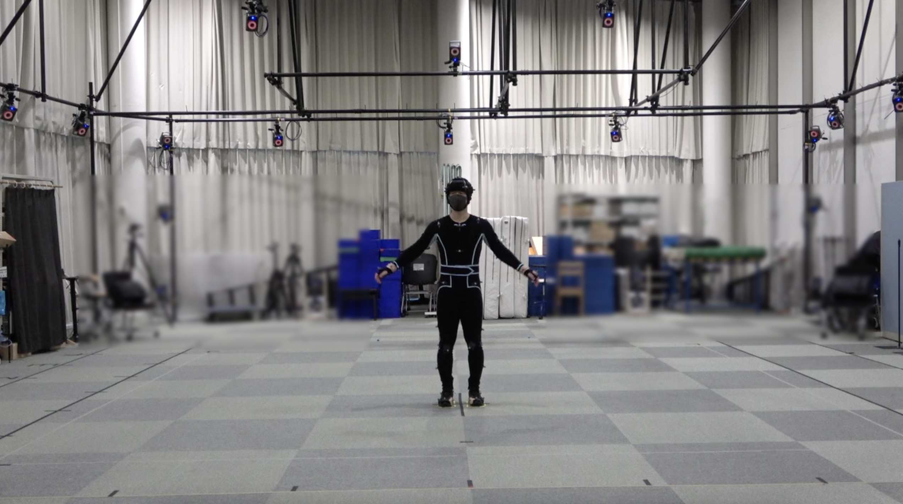

# Bandai-Namco-Research-Motiondataset
This repository provides motion datasets collected by Bandai Namco Research Inc. 

Find [here](README_Japanese.md) for a README in Japanese.

There is a long-standing interest in making diverse stylized motions for games and movies that pursue realistic and expressive character animation; however, creating new movements that include all the various styles of expression using existing methods is difficult. Due to this, Motion Style Transfer (MST) has been drawing attention recently, which aims to convert the motion in a clip with a given content into another motion in a different style, while keeping the same content. A motion is composed of a content and style, where content is the base of the motion and style comprises of the attributes such as mood and personality of the character tied to the motion.

The datasets contain a diverse range of contents such as daily activities, fighting, and dancing; with styles such as active, tired, and happy. These can be used as training data for MST models. The animation below shows examples of visualized motions.

Currently, two datasets are available in this repository and are both located under the `dataset` directory. 

- **Bandai-Namco-Research-Motiondataset-1** ([Details](dataset/Bandai-Namco-Research-Motiondataset-1/README.md))
    - 17 types of wide-range contents including daily activities, fighting, and dancing.
    - 15 styles that include expression variety.
    - A total of 36,673 frames.

- **Bandai-Namco-Research-Motiondataset-2** ([Details](dataset/Bandai-Namco-Research-Motiondataset-2/README.md))
    - 10 types of content mainly focusing on locomotion and hand actions.
    - 7 styles that use a single, uniform expression.
    - A total of 384,931 frames.

You can find a sample script for visualization (using Blender) including step-by-step instructions under the `utils` directory. Please see [here](utils/blender/README.md) for details.

## Data Collection
Each dataset is based on the motion of three professional actors, collected at the motion capture studio of Bandai Namco. We applied post-processing such as noise removal, proportion alignment, and clipping; and saved in BVH format.

## License
The datasets and scripts are available in the following lincenses.
- Bandai-Namco-Research-Motiondataset-1: [CC BY-NC-ND 4.0](dataset/Bandai-Namco-Research-Motiondataset-1/LICENSE)
- Bandai-Namco-Research-Motiondataset-2: [CC BY-NC-ND 4.0](dataset/Bandai-Namco-Research-Motiondataset-2/LICENSE)
- Motion visualization on Blender: [MIT](utils/blender/LICENSE)

## Related works
As mentioned previously, the field of MST has been drawing attention as of late. If you are interested in this topic, please refer to the following non-exhaustive list of research and datasets. The models introduced in these papers show a high-level of performance and the datasets related to MST provide a wide variety of motion data.

### Papers
- (Jurnal of Sensors 2021) A Cyclic Consistency Motion Style Transfer Method Combined with Kinematic Constraints [[Paper]](https://www.hindawi.com/journals/js/2021/5548614/)
- (CVPR 2021) Autoregressive Stylized Motion Synthesis with Generative Flow [[Paper]](https://openaccess.thecvf.com/content/CVPR2021/papers/Wen_Autoregressive_Stylized_Motion_Synthesis_With_Generative_Flow_CVPR_2021_paper.pdf)
- (CVPR 2021) Understanding Object Dynamics for Interactive Image-to-Video Synthesis [[Paper]](https://ieeexplore.ieee.org/document/9577842)
- (ACM Trans. Graph 2020) Unpaired Motion Style Transfer from Video to Animation [[Paper]](https://deepmotionediting.github.io/papers/Motion_Style_Transfer-camera-ready.pdf)

### Datasets
- Deep-motion-editing [[GitHub]](https://github.com/DeepMotionEditing/deep-motion-editing)
- Ubisoft La Forge Animation Dataset [[GitHub]](https://github.com/ubisoft/ubisoft-laforge-animation-dataset)

&copy;  [2022] Bandai Namco Research Inc. All Rights Reserved
