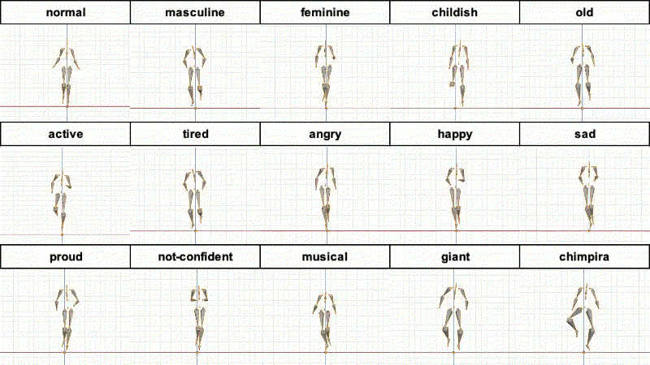
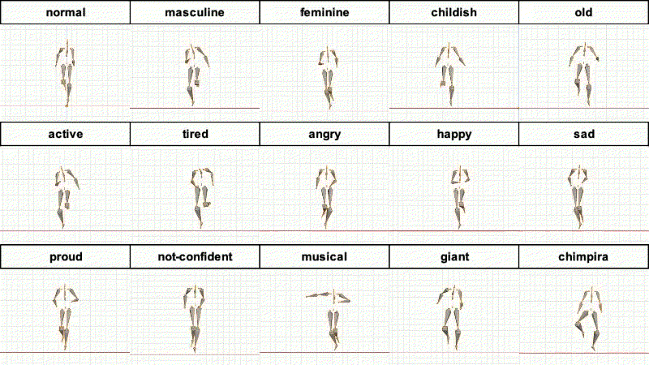
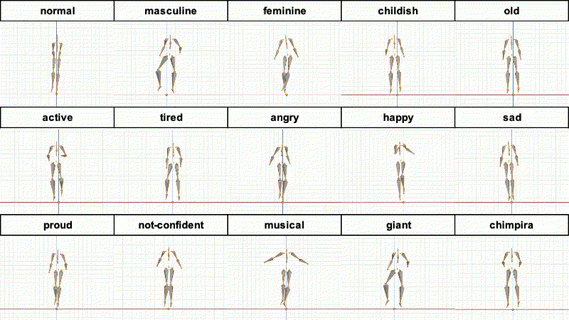
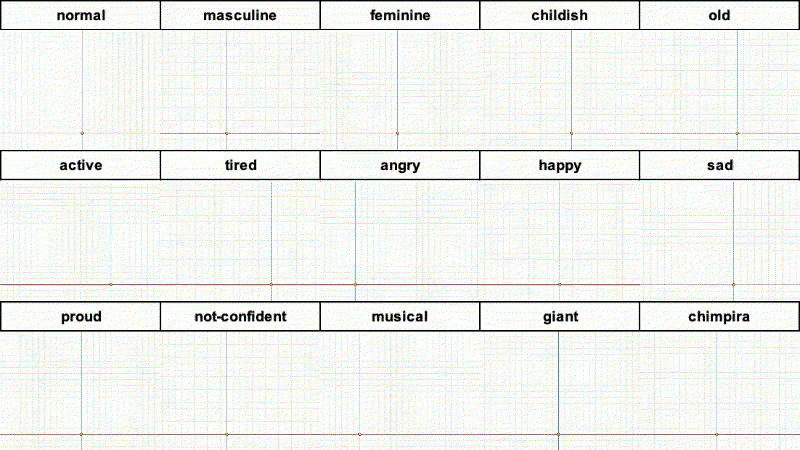
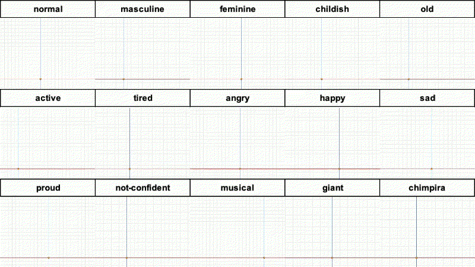
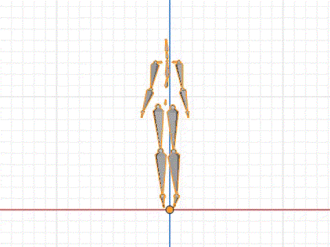
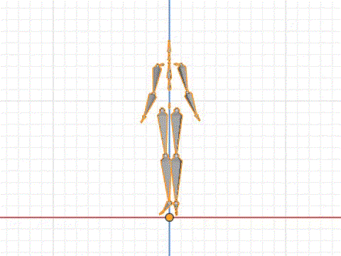
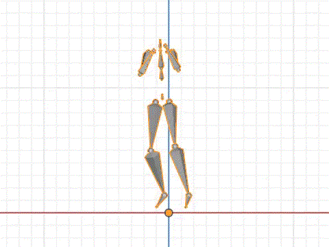
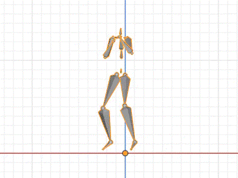
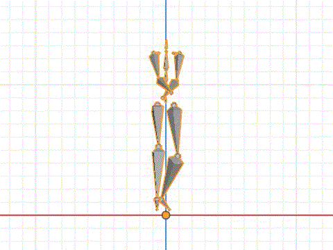

# Bandai-Namco-Research-Motiondataset-1
Bandai-Namco-Research-Motiondataset-1は株式会社バンダイナムコ研究所によって収集されたモーションキャプチャのデータです。
Bandai-Namco-Research-Motiondataset-2と比較すると、内容も多様で、スタイルごとの表現も多様ですがフレーム総数が少ないデータになります。

## Dataset
'data.zip'にBVH形式のモーションとJSON形式の注釈が含まれています。注釈にはコンテンツのIDが含まれており、ファイル名内のモーションのスタイルと対応するラベルは、'cfg/'ディレクトリ内に'content_label.txt'および'style_label.txt'に記載があります。

次のような命名規則で名前が付けられています:`dataset-1_{MOTION}_{STYLE}_{ID}`  
例：`dataset-1_raise-up-both-hands_active`

### Basic Info
|Basic Info||
|--|--|
|Number of Data|175|
|Number of frame|36,673|
|Number of styles|15|
|Number of contents|20|
|Frame Rate|30|

### Contents
- walk
- run
- dash
- walk-back
- walk-right
- walk-left
- bow
- bye
- guide
- byebye
- respond
- call
- kick
- slash
- dance

Please note that `call`, `dance-long`, `dance-short`, `kick`, `punch` and `slash` have only normal motion. 

### Styles
- normal
- happy
- sad
- angry
- proud
- not-confident
- masculinity
- feminine
- children
- old
- tired
- active
- musical
- giant
- chimpira

## Visualization

代表的なモーションを可視化したものを以下に示します。`videos.zip`にすべてのモーションの動画が入っています.

### walk

### run

### dash

### walk-back

### walk-left

### walk-right

### bow

### bye

### guide

### byebye

### respond

### call

### punch

### kick

### slash

### dance-long

### dance-short

&copy;  [2022] Bandai Namco Research Inc. All Rights Reserved
