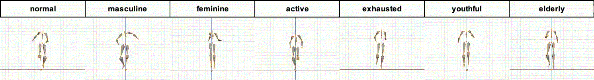
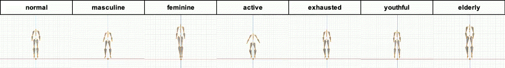
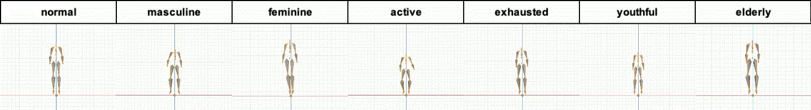
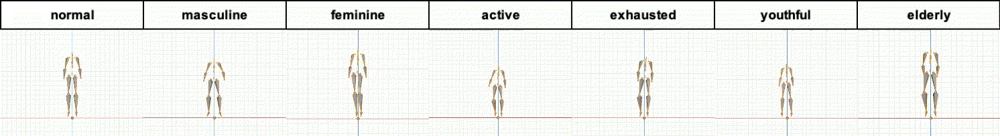

# Bandai-Namco-Research-Motiondataset-2
Bandai-Namco-Research-Motiondataset-2は株式会社バンダイナムコ研究所によって収集されたモーションキャプチャのデータです。  Bandai-Namco-Research-Motiondataset-1と比較すると、このデータセットはコンテンツやスタイルの多様性が少ないですが、
フレーム数が多く収録されています。

## Dataset
'data.zip'にBVH形式のモーションとJSON形式の注釈が含まれています。注釈にはコンテンツのIDが含まれており、ファイル名内のモーションのスタイルと対応するラベルは、'cfg/'ディレクトリ内に'content_label.txt'および'style_label.txt'に記載があります。

次のような命名規則で名前が付けられています: `dataset-2_{MOTION}_{STYLE}_{ID}`  
例 : `dataset-2_raise-up-both-hands_active`

### Basic Info
|Basic Info||
|--|--|
|Number of Data|175|
|Number of frame|384,931|
|Number of styles|7|
|Number of contents|10|
|Frame Rate|30|

### Contents
- walk
- walk-turn-left
- walk-turn-right
- run
- wave-both-hands
- wave-left-hand
- wave-right-hand
- raise-up-both-hands
- raise-up-right-hand
- raise-up-right-hand

### Styles
- active
- elderly
- exhausted
- feminine
- masculine
- normal
- youthful

## Visualization

代表的なモーションを可視化したものを以下に示します。`videos.zip`にすべてのモーションの動画が入っています.

### walk

### walk-turn-left

### walk-turn-right

### run

### wave-both-hands

### wave-left-hand

### wave-right-hand

### raise-up-both-hands

### raise-up-left-hand

### raise-up-right-hand

&copy;  [2022] Bandai Namco Research Inc. All Rights Reserved
