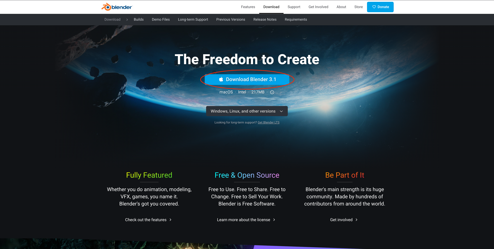
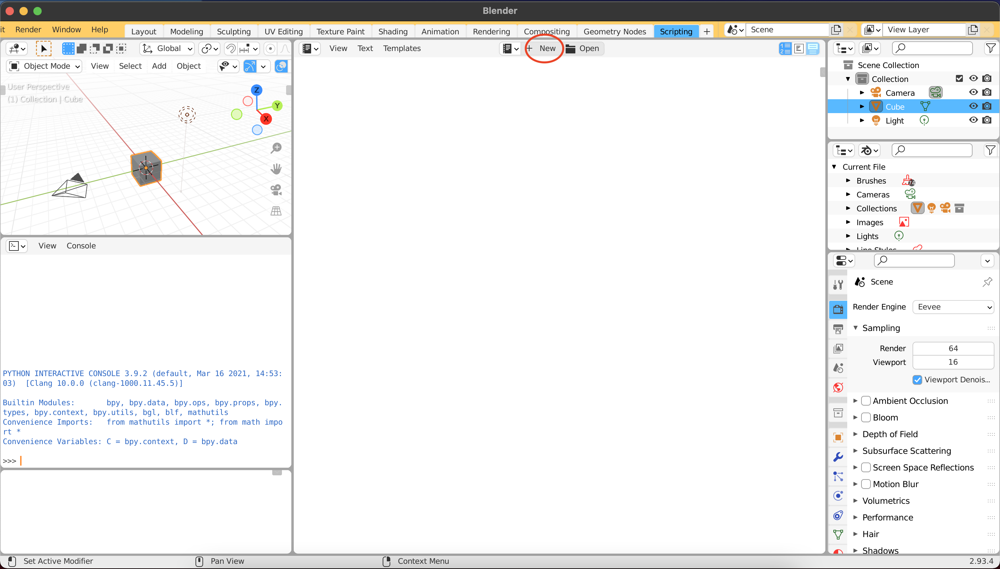
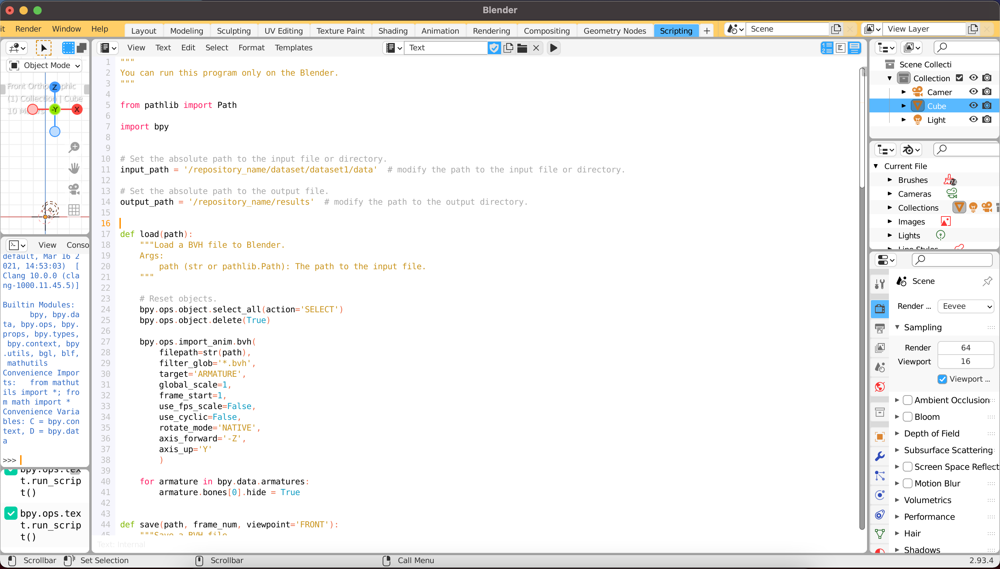
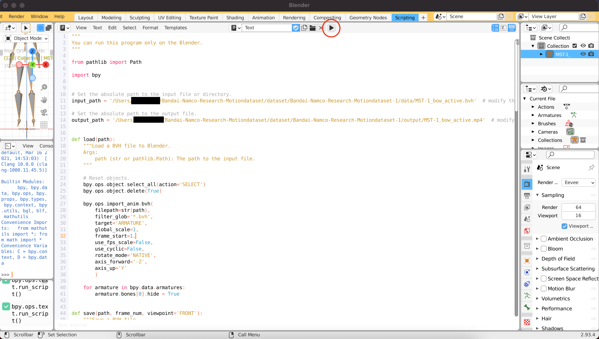

# Motion visualization on Blender

このディレクトリはBVHフォーマットのモーションキャプチャのデータをBlenderで可視化して動画に保存するスクリプトについて記載しています。

## Usage
### 1. Install blender
最初に、[こちら](https://www.blender.org/download/)からBlenderをダウンロードしてインストールします。

Blenderを起動した後、`Scripting`メニューをクリックしてPythonコンソールを開きます。

### 2. Run
提供されているスクリプトは、BlenderのPythonでのみ機能することに注意してください。

#### 2.1 Copy scripts
Click `New` to create new Python script. 

メニューの`New` をクリックして新しいPythonスクリプトを作成します。

次に、提供されたスクリプトをコンソールにコピーします。

#### 2.2 Modify path
スクリプトを開き、`input_path`を変更することで読み込むBVHファイルのパスを指定することができます。動画が保存されるパスは`output_path` で指定します。

#### 2.3 Run
再生ボタンをクリックしてスクリプトを実行します（上の図を参照）。

#### 2.4 Check outputs
レンダリングされたデータは、`output_path` 前に指定した場所にあります。

Blender用のPythonAPIの詳細については、[こちら](https://docs.blender.org/api/current/info_quickstart.html)をご覧ください。

&copy;  [2022] Bandai Namco Research Inc. All Rights Reserved